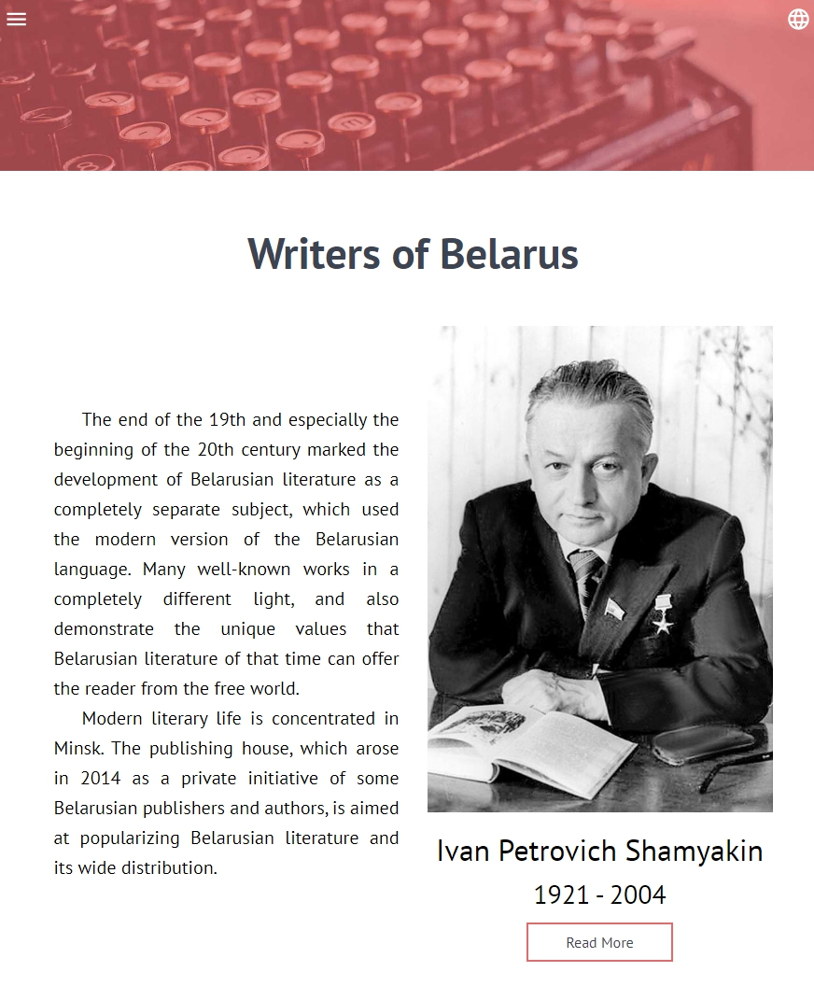

# Storybook for [Cultural Portal "Writers of Belarus"](https://belarus-writers.netlify.com/en/writer/yakub_kolas)

- [Task](https://github.com/rolling-scopes-school/tasks/blob/master/tasks/codejam-culture-portal.md) within the course [React from Rollig Scopes School](https://rs.school/react/)

- [Main repository](https://github.com/Ranisans/belarus-writers)

## Team 2:
 
- [Ruslan Dudenich](https://github.com/Ranisans)
- [Yauheni Vaniushyn](https://github.com/d90375)
- [Gregory Fomenko](https://github.com/fomenkogregory)
- [Oksana Fainitskaya](https://github.com/fainz777)
- [Anna Kulai](https://github.com/annakulai)
- [Aynur Shauerman](https://github.com/aykuli)
